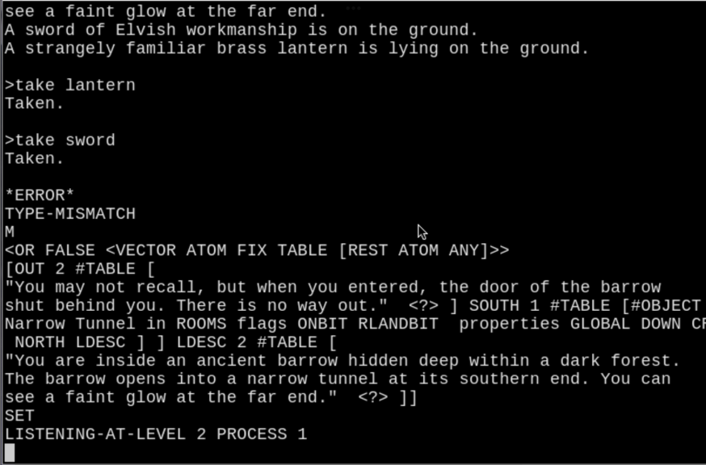

# The ZIL Tool Chain

## Introduction

About two years ago I managed sort of [bring `ZILCH` back to life again](https://github.com/ZoBoRf/ZILCH-How-to).
It was possible to compile [`Zork II`](https://eblong.com/infocom/sources/zork2-mac-r22.zip)
to `ZAP` files, which do not differ (almost) from the original ones.

If you want to follow me in this writeup,
I encourage you to read the first part as it contains
all the links to reference materials and the setup of
the `ITS` operating system needed, and more.

On this year's vacation I wanted to see how far I can get with the rest
of the programs of Infocom's tool chain,
which the [ZIL repository](https://github.com/PDP-10/zil) contains also:

* `zap.mud.171` the *Zork Assembler Program*
* `zip.mud.96` the *Zork Interpreter Program*
* `zil.mud.176` the *"ZIL Interpreter/Table Generator"*

In the meantime [Rick Shiffman](https://github.com/Rick-Shiffman) 
added [Minimal Package System for ITS Muddle](https://github.com/Rick-Shiffman/ITSPKG),
so I probably would have not to work around the problem with the missing subroutines
`<PACKAGE "...">` and `<USE ...>`.


## Running `ZAP`, the *Zork Assembler Program*

So let's fit the `ZAP` files `ZILCH` created into `ZAP`.

I am using a freshly built `ITS`(https://github.com/PDP-10/its/commits/master) from April 22, 2022
(https://github.com/PDP-10/its/commit/e18c2807dd5edde7a84181de3c389f2f9c590165).

### `Zork II` `ZAP` Files Needed

Create a new folder and transfer the following files via `FTP` into it:
```
lcd .../out/Zork2
put "ACTION.ZAP" "ACTION ZAP"  
put "CLOCK.ZAP"  "CLOCK ZAP"   
put "CRUFTY.ZAP" "CRUFTY ZAP"  
put "CRUFTY.XZAP" "CRUFTY XZAP"  
put "DEMONS.ZAP" "DEMONS ZAP"  
put "DUNGEO.ZAP" "DUNGEO ZAP"  
put "MACROS.ZAP" "MACROS ZAP"  
put "MAIN.ZAP"   "MAIN ZAP"    
put "PARSER.ZAP" "PARSER ZAP"  
put "SYNTAX.ZAP" "SYNTAX ZAP"  
put "VERBS.ZAP"  "VERBS ZAP"   
put "ZORK2D.ZAP" "ZORK2D ZAP"  
put "ZORK2S.ZAP" "ZORK2S ZAP"  
put "ZORK2.ZAP"  "ZORK2 ZAP"   
```

Let's look into `ZORK2 ZAP`:
```
	.INSERT "ZORK2DAT"			; DATA IS IN THIS FILE
	.INSERT "DUNGEON"
	.INSERT "SYNTAX"
ENDLOD::
	.INSERT "MACROS"
	.INSERT "CLOCK"
	.INSERT "MAIN"
	.INSERT "PARSER"
	.INSERT "DEMONS"
	.INSERT "CRUFTY"
	.INSERT "VERBS"
	.INSERT "ACTIONS"
	.INSERT "ZORK2STR"
	.END

```

It is the main file the `ZAP` assembler needs to make the binary `ZORK II` story file.
This file includes all the other files in the right order.
I let him use `CRUFTY ZAP` here
and I ignore potential problems with not using `CRUFTY XZAP` for now.

### `ZAP` Files Needed

Now put `ZAP` into the created directory and the packages it uses.

```
lcd .../out/ZAP
put "ZAP.MUD"       "ZAP MUD"
put "ZAC.MUD"       "ZAC MUD"
put "ZSTR.MUD"      "ZSTR MUD"
put "ZOPS.MUD"      "ZOPS MUD"
put "SORTEX.MUD"    "SORTEX MUD"
put "ZAPIT.MUD"     "ZAPIT MUD"
put "ITSPKG.URS234" "ITSPKG URS234"
put "NULL.MUD"      "NULL MUD"
put "FACT.MUD"      "FACT MUD"
```

#### `ZAP MUD`

`ZAP MUD` is basically the original `ZAP.MUD.171` file which I edited slightly.

### Changes made to `ZAP`

Let's look at the differences.

* `ITS MUDDLE` doesn't have `<SORT ` so I use my hacked `<SORTEX ` instead. 
* The original sets `DTRACE?` to `T`, which causes the tracing and dumping
  of the debug symbols (?) using the routines from `ZAC.MUD` package,
  i.e. `DSOPEN`, `DSCLOSE`, `DSPRINT`, `DSREAD`. `ZAP` don't need this stuff to
  produce the story file, so I set `DTRACE?` to `<>` (false, it means).
  The routines in `ZAC` are written with the `MUDDLE`'s own PDP-10 assembler
  (targeting `TOPS-20`) we don`t have.
* So in `ZAC` I replaced the routines with dummies, which instead of doing 
  the real work return dummy values and output their arguments.
* In ```P*INSERT``` I hacked the input file name which is for `TOPS-20` to
  work on `ITS`. 
* The same applies for the `ZIN` file name in the `ZAP` routine.
* The output of how many instructions per second was assembled failed with
  the original code:
  ```
  <PRIN1 <FIX <+ .5 </ ,INS <- <TIME> .OTIME>>>>>
  <PRINC " instructions assembled per second.">
  ```
  I guess `ITS MUDDLE` doesn't allow floats beginning with a decimal point.
  I changed it to 
  ```
  <PRIN1 <FIX <+ 0.5 </ ,INS <- <TIME> .OTIME>>>>>
  <PRINC " instructions assembled per second.">
  ```
  to make it work.
* Here I encountered a big problem with the current `ITS` `MUDDLE 56`.
  `ZAP` writes its output as a binary file. On `TOPS-20` with the extension
  `.ZIP` (the story file extension meant as input for
  the **Z**ork **I**nterpreter **P**rogram).
  Here is the unchanged code:
  ```
  <PRIN1 <FIX <+ .5 </ ,INS <- <TIME> .OTIME>>>>>
  <PRINC " instructions assembled per second.">
  <COND (<SET ZIN <OPEN "PRINTB" <STRING .FILE ".ZIP">>>)
        (<ERROR OPEN-FAILED!-ERRORS ZAP .FILE .ZIN>)>
  <GC-DUMP ,ZCODE .ZIN>
  <CLOSE .ZIN>
  ```
  The output file `ZIN` (sic) is opende in binary mode.
  The compiled story in `,ZCODE` will be written with ```<GC-DUMP ...``` to the file
  and the file is closed.
  The problem is, that `GC-DUMP` doesn't work in this muddle version
  and we have to work around it, don't use it, it means.
  So here is the changed code:
  ```
  <PRIN1 <FIX <+ 0.5 </ ,INS <- <TIME> .OTIME>>>>>
  <PRINC " instructions assembled per second.">
  <BLOAT 20000 0 0 500>
  <GC 0 T>
  <COND (<SET ZIN <OPEN ;"PRINTB" "PRINT" <STRING .FILE ".ZIP">>>)
        (<ERROR OPEN-FAILED!-ERRORS ZAP .FILE .ZIN>)>
  ;<GC-DUMP ,ZCODE .ZIN>
  <PRINT ,ZCODE .ZIN>
  <CLOSE .ZIN>
  <PRINT "<GC-DUMP ,ZCODE .ZIN> DONE.">
  <CRLF>  
  ```
  In my tests the line ```<GC-DUMP ,ZCODE .ZIN> DONE.``` was never reached,
  Muddle crashed. So I changed the output mode from `"PRINTB"` to `"PRINT"`
  and replaced `GC-DUMP` with a simple `PRINT`.
  Before saving the compiled code I do a `BLOAT` and force a garbage collecter
  run `<GC 0 T>`. It made the process a bit more stable, I think `ZORK II`
  pushes the muddle interpreter to its limits here.
  What ```<PRINT ,ZCODE .ZIN>``` produces, I will discuss after the 
  `ZAP` run.

#### `ZAC MUD`

The `ZAC` package contains the assembler routines already mentioned above:
`DSOPEN`, `DSCLOSE`, `DSPRINT`, `DSREAD`. I suppose the are used to store
debug symbols in a suitable binary format.
We ignore this stuff here.

#### `ZSTR MUD`

This package contains conversion routines between `MUDDLE` strings and `Z-STRINGS`.

#### `ZOPS MUD`

The `ZOPS` package contains `ZAP` operation definitions.
I only added ```<DEFOP "VERIFY" 189 T <>>``` here, because `ZORK II`
has the `$VERIFY` verb, which was added at a later time than this early `ZAP`
assembler originates.

#### `SORTX MUD`

This is the replacement for `SORT` routine the original muddle loads on demand
as an `RSUBR` (relocatable subroutine) from a library, which we don't have.
So I hacked one, which is described in the first writeup
about the `ZILCH` compiler.

#### `ZAPIT MUD`, `ITSPKG.URS234` and `NULL MUD`

For convenience, one don't always has to enter the following lines:

```
<FLOAD "ITSPKG >">
<FLOAD "NULL MUD">
<USE "ZAP">
```

The first line loads the new `ITS` package manager.
The second makes sure that `,NULL` is set correctly (stolen from the file `RRS;MUDDLE INIT`).
The third finally loads the `ZAP` assembler.

#### `FACT MUD`

This can be used to test the package manager:

```
:print fact >
<PACKAGE "FACT">

<ENTRY FACT>

<DEFINE FACT (N) ;"the standard recursive factorial"
        <COND (<0? .N> 1)
              (ELSE <* .N <FACT <- .N 1>>>)>>

<ENDPACKAGE>
*:muddle
MUDDLE 56 IN OPERATION.
LISTENING-AT-LEVEL 1 PROCESS 1
<FLOAD "ITSPKG >">$
"DONE"
<USE "FACT">$
USE
<FACT 5>$
120
<QUIT>$

:KILL
```

### Transcript of the `ZAP` Run and the Files Produced

So let's do the actual run.
(`zoborf` is the directory I created for this tests.)

```
:cwd zoborf;

*:print zapit mud

<FLOAD "ITSPKG >">
<FLOAD "NULL MUD">
<USE "ZAP">

:muddle
<FLOAD "ZAPIT MUD">$
<ZAP "ZORK2 ZAP">$
g

 completed in 78 seconds.
ZAP pass #2*** P*INSERT((*INSERT "ZORK2DAT"))***
*** P*INSERT((*INSERT "DUNGEON"))***
*** P*INSERT((*INSERT "SYNTAX"))***
*** P*INSERT((*INSERT "MACROS"))***
*** P*INSERT((*INSERT "CLOCK"))***
*** P*INSERT((*INSERT "MAIN"))***
*** P*INSERT((*INSERT "PARSER"))***
*** P*INSERT((*INSERT "DEMONS"))***
*** P*INSERT((*INSERT "CRUFTY"))***
*** P*INSERT((*INSERT "VERBS"))***
*** P*INSERT((*INSERT "ACTIONS"))***
*** P*INSERT((*INSERT "ZORK2STR"))***
 completed in 108 seconds.
94350 bytes used.
120 instructions assembled per second.
"<GC-DUMP ,ZCODE .ZIN> DONE."

"BEFORE <SORTEX..."
"AFTER <SORTEX..."
"AFTER .SYMS SAVED."
ZAP "DONE".

:KILL
*
```

The following lines of code discussed above

```
  <COND (<SET ZIN <OPEN "PRINT" <STRING .FILE ".ZIP">>>)
        (<ERROR OPEN-FAILED!-ERRORS ZAP .FILE .ZIN>)>
  <PRINT ,ZCODE .ZIN>
  <CLOSE .ZIN>
```

produce a file called `ZORK2 ZAP.ZI`.
Let's look at it:

```
:print zork2 zap.zi

#8 {1 0 0 42 68 100 69 95 51 49 0 64 32 151 40 199 0 0 0 0 0 0 0 0 0 0 0 0 0 0 0
0 0 0 0 0 0 0 0 0 0 0 0 0 0 0 0 0 0 0 0 0 0 0 0 0 0 0 0 0 0 0 0 0 0 0 0 0 0 0 0
0 0 0 0 0 0 0 0 0 0 0 0 0 0 0 0 0 0 5 0 0 0 0 0 0 0 0 0 0 0 0 0 0 0 0 0 0 0 0 0
0 0 0 0 0 0 0 0 0 0 0 0 0 0 0 0 0 12 0 242 2 0 9 18 0 0 12 0 242 3 0 9 40 0 0 12
0 242 5 0 9 66 0 0 0 16 243 203 0 9 92 0 0 12 0 242 84 0 9 109 0 4 32 0 179 0 0
9 135 0 8 32 64 219 60 0 9 176 0 1 32 80 9 0 0 9 210 0 0 210 0 0 0 8 9 237 0 0
18 0 0 0 0 10 17 0 0 32 0 0 0 0 10 38 0 0 0 16 205 0 0 10 58 0 1 32 80 205 12 0
10 73 0 0 33 0 0 0 0 10 102 0 0 33 0 0 0 0 10 138 0 16 224 0 88 17 0 10 170 0 0
224 8 88 18 0 10 191 2 4 32 0 88 21 0 10 215 0 17 32 0 87 22 0 10 233 32 0 32
144 22 0 0 11 16 0 0 32 128 88 0 0 11 43 4 0 64 16 87 24 20 11 63 4 0 64 16 84 0
0 11 82 0 0 0 16 87 25 0 11 101 0 0 192 24 87 0 0 11 116 0 0 192 16 87 19 0 11
131 0 0 128 16 84 23 0 11 147 0 0 16 0 0 0 0 11 163 0 0 0 16 91 30 0 11 190 0 4
0 16 91 0 0 11 220 2 4 32 0 91 29 0 11 247 2 1 32 0 90 0 0 12 23 2 5 32 0 92 0 0
12 70 0 0 0 0 100 0 0 12 117 1 0 192 0 102 0 0 12 140 2 0 32 0 181 0 0 12 172 0
4 0 16 102 35 0 12 201 0 4 0 16 103 0 0 12 225 16 5 32 2 99 50 0 12 249 0 0 0 2
105 0 0 13 32 0 1 32 0 108 0 0 13 50 0 0 16 0 107 0 0 13 70 4 0 128 16 82 71 0
13 91 2 4 160 0 112 45 0 13 112 2 4 160 0 112 46 0 13 141 2 4 160 0 112 0 0 13
168 2 5 32 0 48 0 0 13 197 2 4 160 0 112 44 47 13 226 0 5 32 0 113 0 0 14 2 0 0
16 0 99 51 0 14 41 0 0 0 16 99 0 0 14 66 16 4 32 0 58 53 0 14 80 16 4 32 0 58 54
0 14 117 16 4 32 0 58 0 0 14 156 16 4 32 0 58 52 0 14 195 0 1 32 0 119 0 0 14
241 0 0 32 0 0 0 0 15 13 0 0 192 8 101 0 55 15 35 0 0 32 0 0 0 0 15 58 8 0 32 0
219 0 0 15 85 0 0 0 0 113 49 0 15 107 0 0 0 0 110 0 0 15 121 0 0 64 16 109 0 0
15 135 2 4 32 0 107 42 0 15 149 0 20 32 0 99 39 0 15 181 0 0 16 0 183 0 0 15 231
...
25 53 64 21 16 48 247 11 18 0 136 82 85 69 89 40 28 59 45 0 250 78 0 29 73 224
113 24 9 26 112 0 211 36 9 58 81 120 17 57 141 101 73 1 6 109 67 72 14 103 0 46
52 82 224 85 209 41 32 113 217 52 11 106 248 0 211 36 20 69 32 30 147 43 3 196
165 11 212 104 10 117 72 107 42 0 192 85 87 45 72 100 24 112 211 15 137 59 106 1
211 102 128 101 170 1 42 87 45 96 7 42 52 240 113}

```

`ZCODE` is `SETG`d to ```<SETG ZCODE <IBYTES 8 ,ZPC>>``` where `,ZPC` is the
count of 8 bit bytes used in the `Z-CODE` story file.

According to *The MDL Programming Language* 
`IBYTES` creates a byte-string from implicit arguments.
`IBYTES` takes two required `FIX`es and one optional argument.
It uses the first `FIX` to specify the byte size and the second to specify
the number of elements.
Example array with four 3-bit bytes:

```
<IBYTES 3 4>$
#3 {0 0 0 0}
```

So the file `ZORK2 ZAP.ZI` basically contains the 8-bit-byte array in `ASCII` representation.
How cool is that?

Now we have the compiled story. What do we do with it?

`ZAP` produces another file, the symbol file `ZORK2 ZAP.ZS`.
Let's look at it also:

```
:print zork2 zap.zs
[0 "C-ENABLED?" 0 "M-NOT-HANDLED" 0 "M-END" 0 "P-VERB" 0 "P-SBITS" 0 "P-SRCTOP"
0 "REXIT" 0 "NEXITSTR" 0 "FEXITFCN" 0 "FALSE" 0 "STACK" 1 "DEAD-PALANTIR-4" 1
"P-SPREP1" 1 "P-ALL" 1 "M-BEG" 1 "P-SRCALL" 1 "C-TICK" 1 "UEXIT" 1 "P-LEXWORDS"
1 "P-LEXSTART" 1 "CEXITFLAG" 1 "CEXITSTR" 1 "DEXITOBJ" 1 "DEXITSTR" 1 "S-FEEBLE"
1 "FLAMEBIT" 1 "TRUE" 1 "M-HANDLED" 1 "P-VERBN" 2 "M-FATAL" 2 "P-SPREP2" 2
"P-LEXELEN" 2 "P-ONE" 2 "SHAVE" 2 "P-SRCBOT" 2 "DEAD-PALANTIR-3" 2 "S-FUMBLE" 2
"TURNBIT" 2 "M-ENTER" 2 "NOJUMP" 2 "P-PREP1" 2 "C-RTN" 2 "NEXIT" 3 "P-SFWIM1" 3
"P-SONUMS" 3 "DEAD-PALANTIR-2" 3 "S-FEAR" 3 "FOODBIT" 3 "FEXIT" 3 "M-LOOK" 3
"P-PREP1N" 3 "P-PHRLEN" 3 "P-P1BITS" 3 "P-RTLEN" 4 "SMANY" 4 "CEXIT" 4 "S-FILCH"
4 "LIGHTBIT" 4 "P-PSOFF" 4 "M-FLASH" 4 "P-SFWIM2" 4 "P-PREP2" 4
"GLOBAL-PALANTIR" 4 "P-WORDLEN" 4 "P-INHIBIT" 5 "M-OBJDESC" 5 "DEXIT" 5
"P-SLOC1" 5 "DEAD-PALANTIR-1" 5 "P-P1OFF" 5 "P-PREP2N" 5 "S-FREEZE" 5
"SEARCHBIT" 6 "REPELLENT" 6 "S-FALL" 6 "BURNBIT" 6 "P-NC1" 6 "P-SLOC2" 6
"C-INTLEN" 7 "S-FERMENT" 7 "VEHBIT" 7 "P-SACTION" 7 "SWORD" 7 "P-NC1L" 7
"P-ORPHLEN" 8 "RBUCKBIT" 8 "WAND" 8 "P-NC2" 8 "P-SYNLEN" 8 "STAKE" 8 "S-FIERCE"
9 "P-NC2L" 9 "S-FLOAT" 9 "NWALLBIT" 9 "P-ITBLLEN" 9 "WIZARD" 10 "GENIE" 10
...
67348 "PENTAGRAM-FCN" 67990 "WIZARD-FCN" 68760 "I-WIZARD" 71028 "ROB" 71076
"RIPOFF" 71116 "WIZARD-CASE-FCN" 71314 "WAND-FCN" 71772 "I-WAND" 71778
"WIZARD-QUARTERS-FCN" 71868 "BRIDGE-FCN" 71894 "STREAM-FCN" 71958 "CHASM-FCN"
72102 "PATH-OBJECT" 72162 "TUNNEL-OBJECT" 72190 "STALA-PSEUDO" 72246 "MOSS-FCN"
72324 "ROSE-BUSH-FCN" 72418 "TOP-ETCHINGS-F" 72538 "BOTTOM-ETCHINGS-F" 72620
"CUBE-F"]
```

The symbol file is produced by the following lines
(the `PRINT`s are my output checkmarks):

```
<PRINT "BEFORE <SORTEX...">
	       <SORTEX <> .SYMS 2>
<PRINT "AFTER <SORTEX...">
	       <SET ZIN <OPEN "PRINT" <STRING .FILE ".ZSYM">>>
	       <PRINT .SYMS .ZIN>
	       <CLOSE .ZIN>
<PRINT "AFTER .SYMS SAVED.">  
```

`SYMS` is a `MUDDLE` `VECTOR`.
First this vector is sorted and then written to the file `ZORK2 ZAP.ZS`.
On `TOPS-20` the file would be named `ZORK2.ZSYM`, but for this test
that doesn't bother me.

It will be only read by `ZIP` into the global variable `GLOBAL-SYMBOLS`
and only used to print some tracing info if `,CTRACE` is enabled.

Farther `ZAP` produces the file [`ZORK2 SCRIPT`](in/ZORK2%20SCRIPT), which documents where 
which type of data is placed:

```
0       (*BYTE 1)
1       (*BYTE 0)
2       (ZORKID)
4       (ENDLOD)
6       (START)
8       (VOCAB)
10      (OBJECT)
12      (GLOBAL)
14      (IMPURE)
16      (0)
18      (0)
...
60      (0)
62      (0)
64 (*INSERT "ZORK2DAT")
64 (O?ANY=1)
64 (PS?OBJECT=128)
64 (PS?VERB=64)
64 (PS?ADJECTIVE=32)
...
64 (C-INTLEN=6)
64 (C-TABLELEN=180)
64 (OBJECT:: *TABLE 2357)
64 (0)
66 (0)
...
122 (0)
124 (0)
126 (*OBJECT DEAD-PALANTIR-4,0,FX?ONBIT+FX?RLANDBIT,ROOMS,DEAD-PALANTIR-3,0,T?DEAD-PALANTIR-4)
126     (*EQUAL DEAD-PALANTIR-4,1)
126     (*WORD 0,3072)
...
94312 (*GSTR STR?353,"You execute a perfect swan-dive into the depths below.")
94312   (*PDEF STR?353)
94312   (*STR "You execute a perfect swan-dive into the depths below.") [3028] [26634] [30024] [27434] [192] [21847] [11592] [25624]
94350 (*ENDI)
94350 (*END)
```

## Running `ZIP`, the *Zork Interpreter Program*

Let's try to feed the compiled story file 
(in `ASCII` representation) to `ZIP`. 
We will at least have to replace `GC-READ` with a "normal" `READ` to make it work.

### `ZIP` Files Needed

Now put `ZIP` into the created directory.
It uses the same packages we discussed at `ZAP`,
except the sorting routine `SORTEX`, so we only need:

```
lcd .../out/ZIP
put "ZIP.MUD"   "ZIP MUD"
put "ZIPIT.MUD" "ZIPIT MUD"
put "GETSTR.MUD" "GETSTR MUD"
```

* `ZIP MUD` contains Z-Code the interpreter program.
* The file `GETSTR MUD` is `FLOAD`ed by `ZIP MUD`:
  ```
  <FLOAD "GETSTR">        ;"until compiler bug is fixed"
  ```
* `ZIPIT MUD` will be discussed below.

### Changes made to `ZIP`

Again, let's discuss the changes I've made (here to `ZIP MUD`).

* I added a handler for the `VERIFY` operation:
  ```
  <DEFINE OP-VERIFY () <OP-RETURN 1>>
  <OPDEF "VERIFY">
  ```
  The `$VERIFY` verb will always succeed. What else?
* One problem was, that ```<READSTRING ...``` didn't want to accept the return key.
  So there are some (now commented out) diagnostic outputs.
  ```
  ;<PRINT "BREAKS=">
  ;<PRINT ,BREAKS>
  <SET N <READSTRING .STR ,INCHAN ,BREAKS>>
  ;<SET N <READSTRING .STR ,INCHAN ".">>
  ;<PRINC "[READSTRING DONE]">
  ;<CRLF>
  <READCHR ,INCHAN>
  ;<PRINC "[READ DONE]">
  ;<CRLF>
  ```
  The solution I found is was to change in ```<DEFINE ZREP ...```
  all references from `#LOSE 10` to `#LOSE 13`:
  

  And here in ```<DEFINE ZIP ...```
  

* Finally the replacement of `GC-READ` with `READ` didn't work:
  

  The reading of big array or vectors takes up a lot of space and
  most of the time the garbage collector cames to late, so
  before reading the symbol file a force GC run is done: ```<GC 0 T>```
  But it is of no help for the main `ZCODE` story file.
  So instead of reading the file in ```<DEFINE ZIP ``` we have 
  the following line:
  ```
  <SETG ZCODE ,ZCODE!-INITIAL>
  ```

Why this?

Because of what I suspect memory and gc issues, we have to 
load the `ZCODE` first, and then the `ZIP` interpreter.
After the start of the `MUDDLE` interpreter the seems to exist
large enough contiguous memory region to allocate the 
needed ```<IBYTES ``` memory array.
This is the file `ZIPIT MUD` is used for: 

```
:print ZIPIT MUD
<SETG FILE "ZORK2 ZIPL">
<COND (<SET ZIN <OPEN "READB" ,FILE>>
       <SETG ZCODEL  <READ .ZIN>>
       <CLOSE .ZIN>)
      (<ERROR OPEN-FAILED!-ERRORS ZAP ,FILE .ZIN>)>

<SETG ZCODE <IBYTES 8 <LENGTH ,ZCODEL>>>
<PROG ((N 0))
      <MAPF <>
      #FUNCTION ((V) <PUT ,ZCODE <SET N <+ .N 1>> .V>)
      ,ZCODEL>>
<GUNASSIGN ZCODEL>
<REMOVE ZCODEL>
<GC 0 T>

<FLOAD "ITSPKG >">
<FLOAD "NULL MUD">
<USE "ZIP">
```

`ZIPIT MUD` initially loads the compiled `Z-CODE` from the file `ZORK2 ZIPL`
(see below) into `ZCODEL`,
then constructs the `ZCODE` array from `ZCODEL` in memory, removes the
temporary `ZCODEL` list and forces a garbage collection.
Then it loads the package manager and the `ZIP` package.
Inside the `ZIP` package "namespace" we have to access the here constructed
`ZCODE` global with the above mentioned ```<SETG ZCODE ,ZCODE!-INITIAL>```.

### Transcript of the `ZIP` Run

OK, let's try it:

```
*:date
   TUESDAY, AUGUST 2, 2022  06:08:29 PM
*:muddle
MUDDLE 56 IN OPERATION.
LISTENING-AT-LEVEL 1 PROCESS 1
<FLOAD "ZIPIT">$
"DONE"
<ZIP "ZORK2 ZAP">$
ZORK II: The Wizard of Frobozz
Copyright 1981 by Infocom, Inc.
All rights reserved.
ZORK is a trademark of Infocom, Inc.
Release 42 / Serial number ^@^@^@^@^@^@

Inside the Barrow
You are inside an ancient barrow hidden deep within a dark forest. The barrow o!
pens into a narrow tunnel at its southern end. You can see a faint glow at the !
far end.
A sword of Elvish workmanship is on the ground.
A strangely familiar brass lantern is lying on the ground.

>take all
sword: Taken.lamp: Taken.
>examine sword
I see nothing special about the sword.
>$verify
Verifying game...

>xyzzy
A hollow voice says "Fool."
>quit
Your score would be 0 (total of 400 points), in 4 moves.
This score gives you the rank of Beginner.
Do you wish to leave the game? (Y is affirmative): >y

:KILL
*
```

Oh yeah, it basically seems to work!

I didn't test much further because I mainly wanted to see if it works at all
and that's already more than I expected.


But what is the `ZORK2 ZIPL` file all about?
Let's look at it and compare it with the above `ZORK2 ZAP.ZI`:

```

(1 0 0 42 68 100 69 95 51 49 0 64 32 151 40 199 0 0 0 0 0 0 0 0 0 0 0 0 0 0 0
0 0 0 0 0 0 0 0 0 0 0 0 0 0 0 0 0 0 0 0 0 0 0 0 0 0 0 0 0 0 0 0 0 0 0 0 0 0 0 0
0 0 0 0 0 0 0 0 0 0 0 0 0 0 0 0 0 0 5 0 0 0 0 0 0 0 0 0 0 0 0 0 0 0 0 0 0 0 0 0
0 0 0 0 0 0 0 0 0 0 0 0 0 0 0 0 0 12 0 242 2 0 9 18 0 0 12 0 242 3 0 9 40 0 0 12
0 242 5 0 9 66 0 0 0 16 243 203 0 9 92 0 0 12 0 242 84 0 9 109 0 4 32 0 179 0 0
9 135 0 8 32 64 219 60 0 9 176 0 1 32 80 9 0 0 9 210 0 0 210 0 0 0 8 9 237 0 0
18 0 0 0 0 10 17 0 0 32 0 0 0 0 10 38 0 0 0 16 205 0 0 10 58 0 1 32 80 205 12 0
10 73 0 0 33 0 0 0 0 10 102 0 0 33 0 0 0 0 10 138 0 16 224 0 88 17 0 10 170 0 0
224 8 88 18 0 10 191 2 4 32 0 88 21 0 10 215 0 17 32 0 87 22 0 10 233 32 0 32
144 22 0 0 11 16 0 0 32 128 88 0 0 11 43 4 0 64 16 87 24 20 11 63 4 0 64 16 84 0
0 11 82 0 0 0 16 87 25 0 11 101 0 0 192 24 87 0 0 11 116 0 0 192 16 87 19 0 11
131 0 0 128 16 84 23 0 11 147 0 0 16 0 0 0 0 11 163 0 0 0 16 91 30 0 11 190 0 4
0 16 91 0 0 11 220 2 4 32 0 91 29 0 11 247 2 1 32 0 90 0 0 12 23 2 5 32 0 92 0 0
12 70 0 0 0 0 100 0 0 12 117 1 0 192 0 102 0 0 12 140 2 0 32 0 181 0 0 12 172 0
4 0 16 102 35 0 12 201 0 4 0 16 103 0 0 12 225 16 5 32 2 99 50 0 12 249 0 0 0 2
105 0 0 13 32 0 1 32 0 108 0 0 13 50 0 0 16 0 107 0 0 13 70 4 0 128 16 82 71 0
13 91 2 4 160 0 112 45 0 13 112 2 4 160 0 112 46 0 13 141 2 4 160 0 112 0 0 13
168 2 5 32 0 48 0 0 13 197 2 4 160 0 112 44 47 13 226 0 5 32 0 113 0 0 14 2 0 0
16 0 99 51 0 14 41 0 0 0 16 99 0 0 14 66 16 4 32 0 58 53 0 14 80 16 4 32 0 58 54
0 14 117 16 4 32 0 58 0 0 14 156 16 4 32 0 58 52 0 14 195 0 1 32 0 119 0 0 14
241 0 0 32 0 0 0 0 15 13 0 0 192 8 101 0 55 15 35 0 0 32 0 0 0 0 15 58 8 0 32 0
219 0 0 15 85 0 0 0 0 113 49 0 15 107 0 0 0 0 110 0 0 15 121 0 0 64 16 109 0 0
15 135 2 4 32 0 107 42 0 15 149 0 20 32 0 99 39 0 15 181 0 0 16 0 183 0 0 15 231
...
25 53 64 21 16 48 247 11 18 0 136 82 85 69 89 40 28 59 45 0 250 78 0 29 73 224
113 24 9 26 112 0 211 36 9 58 81 120 17 57 141 101 73 1 6 109 67 72 14 103 0 46
52 82 224 85 209 41 32 113 217 52 11 106 248 0 211 36 20 69 32 30 147 43 3 196
165 11 212 104 10 117 72 107 42 0 192 85 87 45 72 100 24 112 211 15 137 59 106 1
211 102 128 101 170 1 42 87 45 96 7 42 52 240 113)
```

The only difference is this:
While `ZORK2 ZAP.ZI` contains a vector, which needs a continuous chunk of memory,
`ZORK2 ZIPL` contains a simple list, which ```<SETG ZCODEL  <READ .ZIN>```
in ```ZIPIT MUD``` manages to read without a failing garbage collection.
My attempts to read the following vectors  
* ```#8 {1 0 0 42 68 100 69 ... 42 52 240 113}```
* ```![1 0 0 42 68 100 69 ... 42 52 240 113!]```
directly, failed, so I have to use the normal list as a workaround.

I created `ZORK2 ZIPL` from `ZORK2 ZAP.ZI` using `Emacs` on `ITS`.
Only the beginning of the first and end of the last line (non empty)
had to be changed.


## Running `ZIL`, the `ZIL` interpreter

So it remains for us to look at `ZIL`, the `ZIL` interpreter.
The comment at the beginning of the `ZIL MUD` file says:
```
"ZIL Interpreter/Table Generator"
```
This program should load, parse and run the `ZIL` files directly,
without having to use the `ZILCH`, `ZAP`, `ZIP` chain. Cool stuff...

### `ZIL` Files Needed

Now put `ZIL` into the created directory.

```
lcd .../out/ZIL
put "ZIL.MUD"    "ZIL MUD"
put "ZORK2.ZIL"  "ZORK2 ZIL"
put "DUNGEO.ZIL" "DUNGEO ZIL"
put "SYNTAX.ZIL" "SYNTAX ZIL"
put "MACROS.ZIL" "MACROS ZIL"
put "CLOCK.ZIL"  "CLOCK ZIL"
put "MAIN.ZIL"   "MAIN ZIL"
put "PARSER.ZIL" "PARSER ZIL"
put "DEMONS.ZIL" "DEMONS ZIL"
put "CRUFTY.ZIL" "CRUFTY ZIL"
put "VERBS.ZIL"  "VERBS ZIL"
put "ACTION.ZIL" "ACTION ZIL"
```

Here we need the `ZORK II` `ZIL` source files, too.
`ZORK2 ZIL` includes the other ones.

### Transcript of the `ZIL` Run

Let's try this last one:
```
*:muddle
MUDDLE 56 IN OPERATION.
LISTENING-AT-LEVEL 1 PROCESS 1
<FLOAD "ZIL">$
"DONE"
<ZLOAD "ZORK2">$
Loading ZORK2.ZIL (FLOAD)
Loader/ ZORK II: The Wizard of Frobozz
Loading DUNGEON.ZIL (FLOAD)
Loading SYNTAX.ZIL (FLOAD)
Loading MACROS.ZIL (FLOAD)
Loading CLOCK.ZIL (FLOAD)
Loading MAIN.ZIL (FLOAD)
Loading PARSER.ZIL (FLOAD)
Loading DEMONS.ZIL (FLOAD)
Loading CRUFTY.ZIL (FLOAD)
Loading VERBS.ZIL (FLOAD)
Loading ACTIONS.ZIL (FLOAD)
"DONE"
<ZIL>$
ZORK II: The Wizard of Frobozz|
Copyright 1981 by Infocom, Inc.|
All rights reserved.|ZORK is a trademark of Infocom, Inc.|
Release 0 / Serial number ^@^@^@^@^@^@

Inside the Barrow
You are inside an ancient barrow hidden deep within a dark forest.
The barrow opens into a narrow tunnel at its southern end. You can
see a faint glow at the far end.
A sword of Elvish workmanship is on the ground.
A strangely familiar brass lantern is lying on the ground.

>take all
sword: Taken.
lamp: Taken.

>examine sword
I see nothing special about the sword.

>xyzzy
A hollow voice says "Fool."

>quit
Your score would be 0 (total of 400 points), in 3 moves.
This score gives you the rank of Beginner.
Do you wish to leave the game? (Y is affirmative): >y

:KILL
*
```

Probably you already noticed small differences in the output:
The staring banner still contains the pipe chars and
the things taken are here on a separate line.
But: Oh yeah, it basically seems to work, too!

### Changes made to `ZIL`

The changes I made to this one:

* Commented out ```;<FLOAD "TELL.XBIN">```. We do not have this `RSUBR` file.
  ```
  ;"For READST"
  
  ;<FLOAD "TELL.XBIN">
  ```
* ```NEXTP``` failed with a `DECL` wrong type error. 
  
  I suppose this is probably a DECL check bug in `MUDDLE`. I changed declaration of
  `(M)` to `ANY` to make it work.
  
* In ```<DEFINE READ!-ZO ...``` I replaced
  ```
  <SET LEN <READST .INS "" <>>>
  ```
  by
  ```
  <SET LEN <READSTRING .INS ,INCHAN <STRING <ASCII 10>>>>
  <READCHR ,INCHAN>
  ```
  We don't have `READST` (c.f. comment to `TELL.XBIN` above), but we have `READSTRING`.
* In ```<DEFINE ZIL ...``` I had to put a ```#LOSE 13``` into the input channel
  slot 6. Why this? Let's look at the output of ```<BACK ,INCHAN>```:

  ```
  ,INCHAN$
  #CHANNEL [2 "READ" "INPUT" ">" "TTY" " " "INPUT" ">" "TTY" " " 5122 23748404082
  <ERROR END-OF-FILE!-ERRORS> 17179869211 23085705369 () 80 10 ""]

  <BACK ,INCHAN>$
  [![#LOSE *260740764110* #LOSE *260740764123* #LOSE *000000000000* #LOSE
  *000000000177* #LOSE *000000000000* #LOSE *000000000033* #LOSE *000000000134* #
  LOSE *000000000000* #LOSE *000000000014* #LOSE *000000000004* #LOSE
  *010705000012* #LOSE *362050141626* #LOSE *201311147206* #LOSE *442031637066* #
  LOSE *416210147174* #LOSE *371743300000* #LOSE *000000000000* #LOSE
  *000000000000* #LOSE *000000000000* #LOSE *000000000000* #LOSE *000000000000* #
  LOSE *000000000000* #LOSE *000000000000* #LOSE *000000000000* #LOSE
  *000000000000* #LOSE *000000000000* #LOSE *000000000000* #LOSE *000000000000* #
  LOSE *000000000000* #LOSE *000000000000* #LOSE *000000000000*!] 2 "READ"
  "INPUT" ">" "TTY" " " "INPUT" ">" "TTY" " " 5122 23748404082 <ERROR
  END-OF-FILE!-ERRORS> 17179869211 23085705369 () 95 10 ""]
  ```
  Let's reformat it to make it a little bit more readable.
  ```
  <1 <BACK ,INCHAN>>$
  ![
  #LOSE *260740764110* 
  #LOSE *260740764123* 
  #LOSE *000000000000* 
  #LOSE *000000000177* 
  #LOSE *000000000000* 
  #LOSE *000000000033*    ESC
  #LOSE *000000000134* 
  #LOSE *000000000000* 
  #LOSE *000000000014* 
  #LOSE *000000000004* 
  #LOSE *010705000012* 
  #LOSE *361424036204* 
  #LOSE *406071320130* 
  #LOSE *446350344202* 
  #LOSE *471747615400* 
  #LOSE *000000000000* 
  #LOSE *000000000000* 
  #LOSE *000000000000* 
  #LOSE *000000000000* 
  #LOSE *000000000000* 
  #LOSE *000000000000* 
  #LOSE *000000000000* 
  #LOSE *000000000000* 
  #LOSE *000000000000* 
  #LOSE *000000000000* 
  #LOSE *000000000000* 
  #LOSE *000000000000* 
  #LOSE *000000000000* 
  #LOSE *000000000000* 
  #LOSE *000000000000* 
  #LOSE *000000000000*
  !]

  <6 <1 <BACK ,INCHAN>>>$
  #LOSE *000000000033*

  ```

  Originally slot 6 contains the escape ASCII code 27 (33 octal). Escape must be used to terminate
  and evaluate an input line. I changed it to 13 to make the input channel accept a
  carriage return in `READSTRING`. 
  This is not documented in *The MDL Programming Language* as far I can see.
  

  In ```<ROUTINE ZLOAD ... ``` I added a `T` as second argument to ```<ZFLOAD ...``` call
  to force it using `FLOAD` instead of the default `GROUP-LOAD` we don't have.
  The file names to load I changed from the `TOPS-20` `FROB.ZIL` to `ITS` naming `FROB ZIL`.
  That's all.

## Future Perspectives

* Examine the contents of `ZORK2 ZAP.ZI`
* Trying to use the `MUDDLE 106` on `TOPS-20` (a working one can be found on 
  `toad-2@tty.livingcomputers.org`(https://wiki.livingcomputers.org/doku.php?id=xkl_toad-2)
  ```
  @login noaccount
   Job 17 on TTY27 4-Sep-2022  9:17AM
   Previous LOGIN: 3-Sep-2022  5:24AM
  [Querying terminal type]
  [VT100]
  Chateaubriand's birthday
  First newsboy, 1833
  First glass in England, 1567
   End of COMAND.CMD.1
  @mdl106
  MUDDLE 106 IN OPERATION.
  LISTENING-AT-LEVEL 1 PROCESS 1
  <+ 40 2>$
  42
  ```
  I have tried to use the muddle version(s) from [Living Computers](https://www.livingcomputers.org/)
  on my local `TOPS-20`
  `Panda` distribution. With mixed results. But this is another story.

## ToDo

* Look into the small differences in the output of `ZIP` and `ZIL`
* Perhaps somebody can repair the `GC-SAVE` and `GC-READ` stuff in current `ITS` muddle?
  [Adam T. Sampson](https://github.com/atsampson) and 
  [Lars Brinkhoff](https://twitter.com/larsbrinkhoff) achieved great results in this field
  (https://github.com/PDP-10/its/issues/1957).

